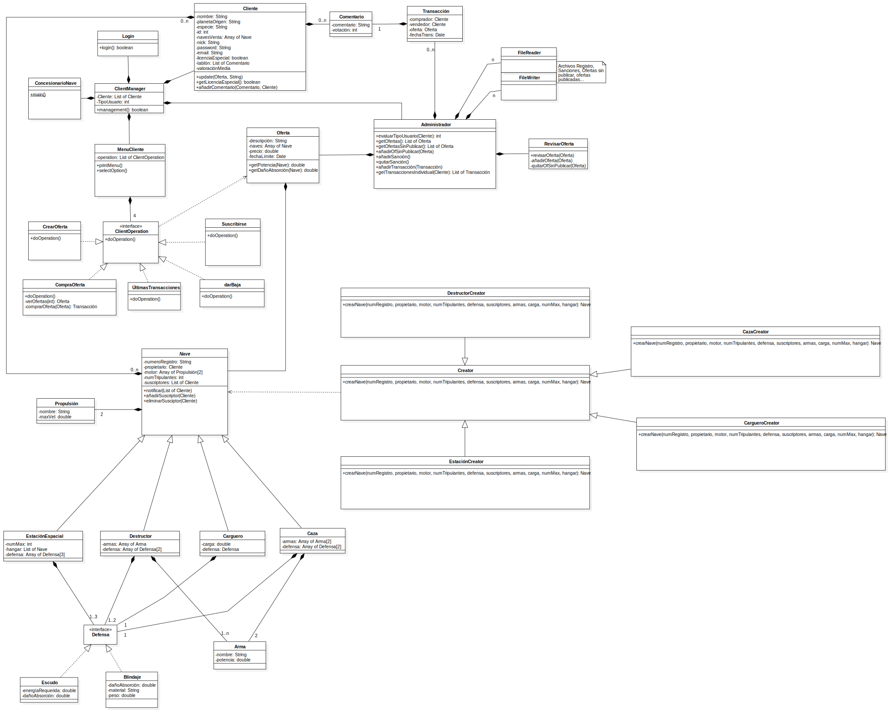

# Concesionario-Naves

## Índice

* [Memoria](#memoria-explicativa)
* [UML](#diagrama-UML-propuesto)
* [Equipo](#equipo-de-desarrollo)
* [Tecnologías](tecnologías-usadas)
* [Licencia](#licencia)
* [Versión](#versión)

## Memoria explicativa

En primer lugar, para la implementación de la clase nave, hemos decidido usar el
patrón creacional Factory Method. El objetivo de esto ha sido crear una interfaz para
crear naves, pero dependiendo de la subclase se crea una nave en concreto.
Además, esta nave puede ser de diferentes tipos: carguero, estación espacial,
destructor y caza. Por ello, la clase ‘Nave’ es una clase abstracta de la cual heredan los
tipos mencionados anteriormente.
Una vez explicado el concepto general de la nave, cabe destacar las clases ‘Arma’,
‘Propulsión’ y la interfaz ‘Defensa’.
La interfaz ‘Defensa’ es implementada por ‘Escudo’ y ‘Blindaje’, los cuales son los
únicos dos mecanismos de defensa que pueden equipar las naves. Es una interfaz
debido a que cada mecanismo tiene unas propiedades diferentes, pero al implementar
las propiedades de las naves, estas se almacenan en un Array de ‘Defensa’ diferente en
cada subtipo de nave.
La clase ‘Propulsión’ se refiere al tipo de motor que pueden equipar las distintas naves.
Este valor se almacena en un Array de longitud 2 como máximo dependiendo del tipo
de nave.
Por último, en los componentes de la nave encontramos la clase ‘Arma’, la cual solo se
encuentra en las naves de tipo destructor (Tiene 1 o más) y caza (Tiene 2).
Una vez analizada la estructura que construye los diferentes tipos de naves y sus
componentes, analizaremos la interacción entre los distintos clientes, las ofertas que
publican, el administrador y las distintas transacciones que se realicen.
En primer lugar, la clase ‘ConcesionarioNave’ inicia el programa y crea un objeto de
tipo ‘ClientManager’ que será el encargado de llevar la operativa del programa hasta
su fin.
Una vez logeado mediante la clase login, en base al archivo clientes, se evalúa el
cliente y a partir de sus sanciones, registradas en un archivo, se devuelve un entero
que se guarda para el resto de la sesión en TipoUsuario.
Tras esto se imprime el menú y se selecciona una operación:
- ComprarOferta: Se muestra la lista de naves en función de TipoUsuario y se
podrá comprar una oferta. En este proceso de compra se crea una transacción
que se guarda en el archivo de registro y se le pedirá una valoración y un
comentario de la compra que se guardará en el tablón del vendedor y
puntuación media.
- CrearOferta: Se introducen los datos del producto/s a vender y se envía al
administrador (Mediante la inclusión de esta oferta en el fichero ofertas sin
publicar) para que la evalúe mediante su clase RevisarOferta para añadirla
definitivamente al fichero de ofertas publicadas.
- Suscribirse: El cliente selecciona un tipo de nave en el que está interesado y sus
datos se almacenan en la lista de suscriptores de ese tipo de nave. Cuando esta
nave esté incluida en una oferta se notificará al usuario.
- DarBaja: El cliente selecciona el tipo de nave en el que no está interesado y no
recibirá más avisos sobre ese tipo de nave.
- ÚltimasTransacciones: Devuelve al cliente sus últimas transacciones a partir del
fichero transacciones filtrándolo y devolviendo solo en las que aparece el
cliente en cuestión.
Para la realización de estas listas de suscripciones se utiliza el patrón de
comportamiento Observer, el cual permite este tipo de funcionamiento.
Por último, en cuanto al administrador contiene diferentes métodos para poder
acceder y modificar los diferentes archivos en los que se almacenan todos los datos del
programa. Así como un menú para poder revisar una oferta y decidir si publicarla o no.

## Diagrama UML propuesto

## Equipo de desarrollo

* Alejandro López Adrados: [@AlejandroAdrados](https://github.com/AlejandroAdrados)
* Guillermo Grande Santi: [@BiggestGuille](https://github.com/BiggestGuille)
* Nicolás Rubira Cabello: [@nicorubira](https://github.com/nicorubira)
* Adrián Morales Dato: [@Adri-md-1208](https://github.com/Adri-md-1208)

## Tecnologías usadas

* JDK 15.01
* Git 2.25.1

## Licencia

GPLv3

## Versión

0.0
